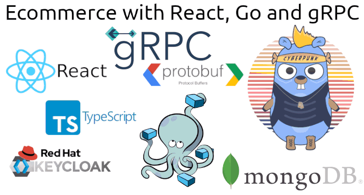

# Go gRPC Ecommerce - Pt 3 - Connect the Frontend with the Backend / Go And React

In this 3 articles series I will show you how to use gRPC to create an ecommerce with frontend in React and Backend in GO.

We will use React, Typescript, Keycloak, gRPC, Protocol Buffer, Docker Compose, MongoDB e Go!

# Part 1 - Frontend

Article: https://www.linkedin.com/pulse/go-grpc-ecommerce-pt-1-react-jos%C3%A9-augusto-zimmermann-negreiros/

Files: https://github.com/gugazimmermann/go-grpc-ecomm-react

# Part 2 - Backend

Article: https://www.linkedin.com/pulse/go-grpc-ecommerce-pt-2-go-jos%C3%A9-augusto-zimmermann-negreiros/

Files: https://github.com/gugazimmermann/go-grpc-ecomm-go

# Part 3 - Connect the Frontend with the Backend

Article: https://www.linkedin.com/pulse/go-grpc-ecommerce-pt-2-go-jos%C3%A9-augusto-zimmermann-negreiros/

Frontend: https://github.com/gugazimmermann/go-grpc-ecomm-react
Backend: https://github.com/gugazimmermann/go-grpc-ecomm-go

## Git Submodules

Now we will use Frontend and Backend together, so to make it easier we will use Git Submodules:

`git submodule add git@github.com:gugazimmermann/go-grpc-ecomm-react.git frontend`

`git submodule init`

This will create the frontend folder, but it will remain another repository, so changes made to the frontend must be controlled from within this folder, such as git commit.

To avoid mistakes, just add `/frontend` inside `.gitignore`