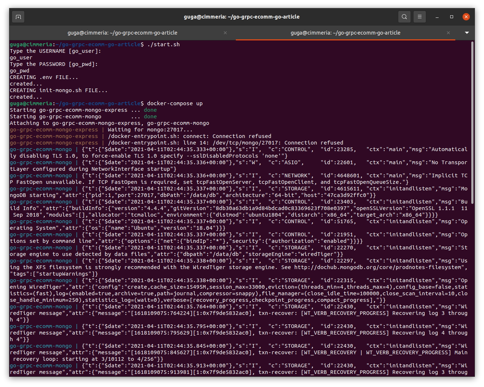
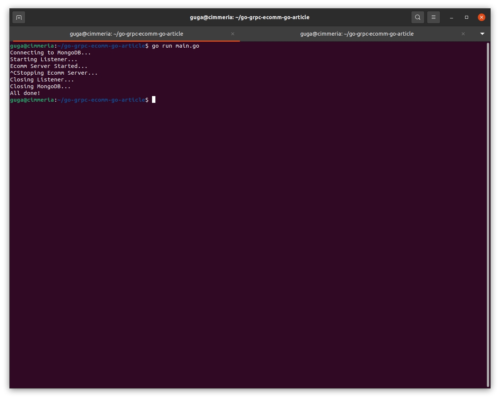
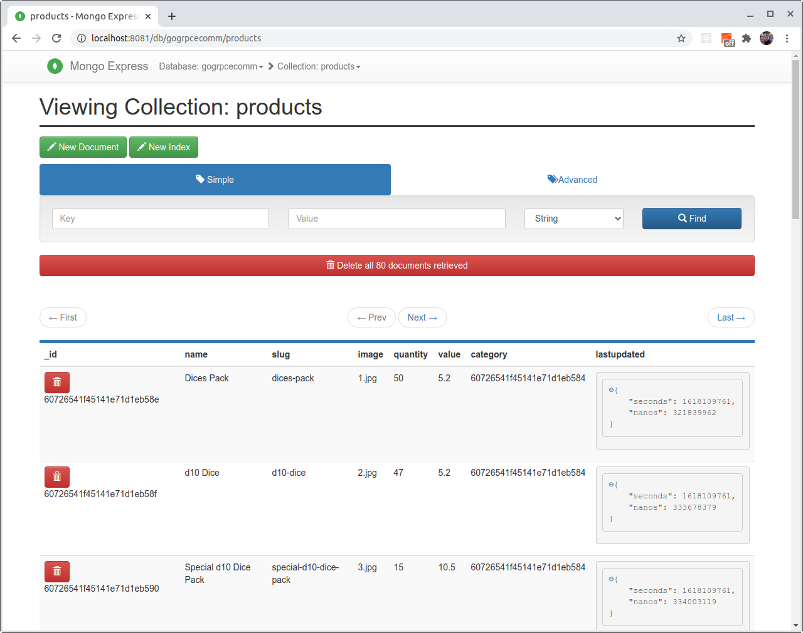
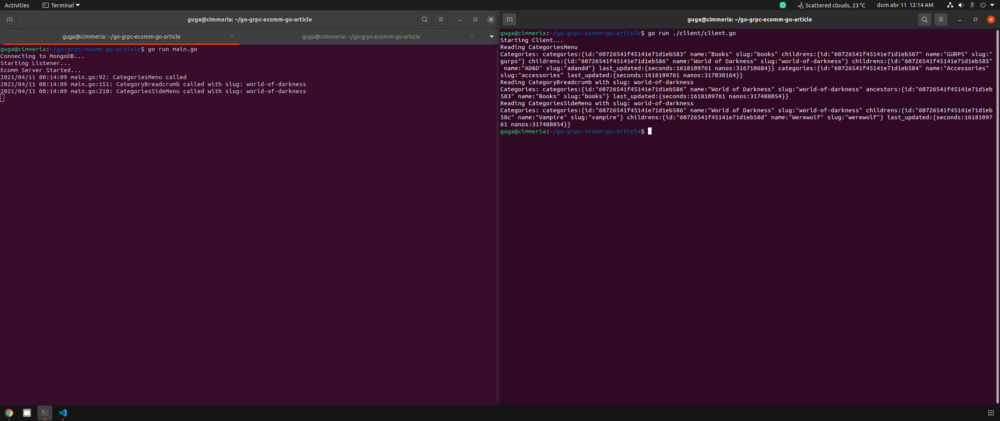
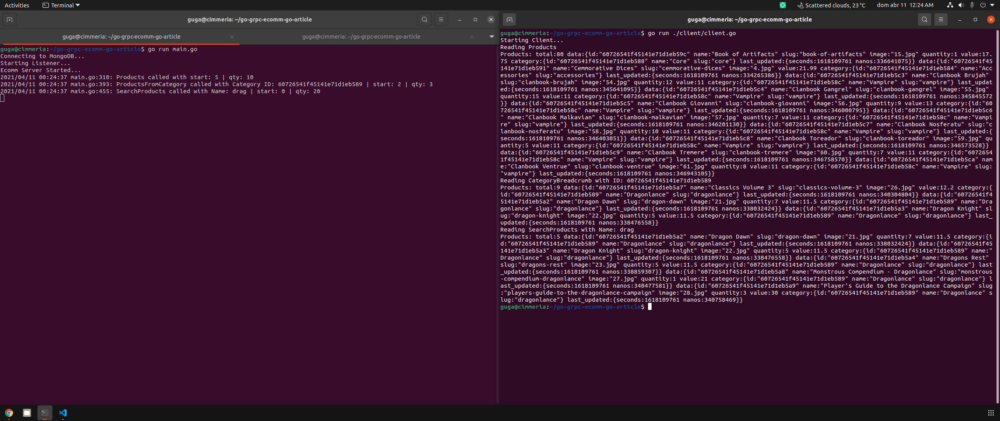

# Go gRPC Ecommerce - Pt 2 - Go


In this 3 articles series I will show you how to use gRPC to create an ecommerce with frontend in React and Backend in GO.

We will use React, Typescript, Keycloak, gRPC, Protocol Buffer, Docker Compose, MongoDB e Go!

# Part 1 - Frontend

Article: https://www.linkedin.com/pulse/go-grpc-ecommerce-pt-1-react-jos%C3%A9-augusto-zimmermann-negreiros/

Files: https://github.com/gugazimmermann/go-grpc-ecomm-react

# Part 2 - Backend

Article: https://www.linkedin.com/pulse/go-grpc-ecommerce-pt-2-go-jos%C3%A9-augusto-zimmermann-negreiros/

Files: https://github.com/gugazimmermann/go-grpc-ecomm-go

If you have seen my previous articles on gRPC, you certainly know how to install GO, gRPC, ProtoBuf, etc... Then I will go through these parts quickly. And since the idea of the articles is not to create a fully functional ecommerce for production, but to show the integration between React and GO, some parts will be left behind.

## Go Mod

First of all we need to initialize the Go Modules, chanhe the Git to your own.

`go mod init github.com/gugazimmermann/go-grpc-ecomm-go`

## MongoDB

https://www.linkedin.com/pulse/phone-book-go-grpc-protobuf-docker-mongodb-zimmermann-negreiros/

In this article you can see how to install Docker, Docker Compose and MongoDB. We will again use a bach file to setup mongo information and store in a .env file.

`docker-compose.yml`

```yml
version: "3"
services:
  mongo-express:
    image: mongo-express:latest
    container_name: go-grpc-ecomm-mongo-express
    restart: unless-stopped
    ports:
      - 8081:8081
    env_file: .env
    environment:
      ME_CONFIG_MONGODB_PORT: 27017
      ME_CONFIG_MONGODB_ADMINUSERNAME: $MONGO_USERNAME
      ME_CONFIG_MONGODB_ADMINPASSWORD: $MONGO_PASSWORD
      ME_CONFIG_BASICAUTH_USERNAME: $MONGO_USERNAME
      ME_CONFIG_BASICAUTH_PASSWORD: $MONGO_PASSWORD
    networks:
      - go-grpc-ecomm

  mongo:
    image: mongo:latest
    container_name: go-grpc-ecomm-mongo
    restart: unless-stopped
    env_file: .env
    environment:
      MONGO_INITDB_ROOT_USERNAME: $MONGO_USERNAME
      MONGO_INITDB_ROOT_PASSWORD: $MONGO_PASSWORD
      MONGO_INITDB_DATABASE: $MONGO_DB
    ports:
      - 27017:27017
    expose:
      - 27017
    volumes:
      - dbdata:/data/db
      - ./init-mongo.sh:/docker-entrypoint-initdb.d/init-mongo.sh:ro
    networks:
      - go-grpc-ecomm

networks:
  go-grpc-ecomm:
    driver: bridge

volumes:
  dbdata:
```

`start.sh`

```bash
#!/bin/bash

read -p "Type the USERNAME [go_user]: " MONGO_USERNAME
MONGO_USERNAME=${MONGO_USERNAME:-go_user}
echo $MONGO_USERNAME

read -p "Type the PASSWORD [go_pwd]: " MONGO_PASSWORD
MONGO_PASSWORD=${MONGO_PASSWORD:-go_pwd}
echo $MONGO_PASSWORD

MONGO_DB=gogrpcecomm

if [[ -z "${MONGO_USERNAME}" || -z "${MONGO_PASSWORD}" || -z "${MONGO_DB}" ]]; then
    echo "required inputs misssing"
    exit 1
fi

echo "CREATING .env FILE..."
cat >.env <<EOF
MONGO_USERNAME=${MONGO_USERNAME}
MONGO_PASSWORD=${MONGO_PASSWORD}
MONGO_DB=${MONGO_DB}
EOF
echo "created..."

echo "CREATING init-mongo.sh FILE..."
cat >init-mongo.sh <<EOF
#!/usr/bin/env bash

echo 'Creating application user and db';

mongo ${MONGO_DB} \
 --username ${MONGO_USERNAME} \
 --password ${MONGO_PASSWORD} \
 --authenticationDatabase admin \
 --host localhost \
 --port 27017 \
 --eval "db.createUser({user: '${MONGO_USERNAME}', pwd: '${MONGO_PASSWORD}', roles:[{role:'dbOwner', db: '${MONGO_DB}'}]});"

echo 'User: ${MONGO_USERNAME} create to database ${MONGO_DB}';

EOF
echo "created..."

exit 0

```

Run `chmod +x start.sh` and then `./start.sh`. To start mongo run `docker-compose up` and open http://localhost:8081/ to access Mongo Express.

`.gitignore`

```
.env
init-mongo.sh

```



## Test Server

Let's start creating a test server as a base to see if everything is working.

In your proto file we will define the message for Category and Product in a way we can use it with the React page. And then we move to the products.

`ecommpb/ecomm.proto`

```protobuf

syntax = "proto3";

package ecomm;

option go_package = "ecommpb/ecommpb";

import "google/protobuf/timestamp.proto";

message Category {
  string id = 1;
  string name = 2;
  string slug = 3;
  repeated Category ancestors = 4;
  repeated Category childrens = 5;
  google.protobuf.Timestamp last_updated = 6;
}

message Product {
  string id = 1;
  string name = 2;
  string slug = 3;
  string image = 4;
  int32 quantity = 5;
  float value = 6;
  Category category = 7;
  google.protobuf.Timestamp last_updated = 8;
}

service EcommService {}

```

`genpb.sh`

```bash
#!/bin/bash

protoc ecommpb/ecomm.proto --go_out=plugins=grpc:.

```

Run `chmod +x genpb.sh`, now when we change the proto file we can just run this bash script.

In this file we will get the env file information and start the Mongo Client, start the listener and the gRPC server.

`main.go`

```go
package main

import (
	"context"
	"fmt"
	"log"
	"net"
	"os"
	"os/signal"
	"time"

	"github.com/gugazimmermann/go-grpc-ecomm-go/ecommpb/ecommpb"
	"github.com/joho/godotenv"
	"go.mongodb.org/mongo-driver/mongo"
	"go.mongodb.org/mongo-driver/mongo/options"

	"google.golang.org/grpc"
)

type server struct{}

var products, categories *mongo.Collection

func main() {
	log.SetFlags(log.LstdFlags | log.Lshortfile)

	err := godotenv.Load(".env")
	if err != nil {
		log.Fatalf("Error loading .env file")
	}
	mongoUsername := os.Getenv("MONGO_USERNAME")
	mongoPassword := os.Getenv("MONGO_PASSWORD")
	mongoDb := os.Getenv("MONGO_DB")

	mongoCtx, cancel := context.WithTimeout(context.Background(), 10*time.Second)
	defer cancel()

	mongoUri := fmt.Sprintf("mongodb://%s:%s@localhost:27017", mongoUsername, mongoPassword)
	fmt.Println("Connecting to MongoDB...")
	client, err := mongo.Connect(mongoCtx, options.Client().ApplyURI(mongoUri))
	if err != nil {
		log.Fatalf("Error Starting MongoDB Client: %v", err)
	}

	products = client.Database(mongoDb).Collection("products")
	categories = client.Database(mongoDb).Collection("categories")

	fmt.Println("Starting Listener...")
	l, err := net.Listen("tcp", "0.0.0.0:50051")
	if err != nil {
		log.Fatalf("Failed to listen: %v", err)
	}
	opts := []grpc.ServerOption{}
	s := grpc.NewServer(opts...)
	ecommpb.RegisterEcommServiceServer(s, &server{})

	go func() {
		fmt.Println("Ecomm Server Started...")
		if err := s.Serve(l); err != nil {
			log.Fatalf("Failed to start server: %v", err)
		}
	}()

	ch := make(chan os.Signal, 1)
	signal.Notify(ch, os.Interrupt)

	<-ch
	fmt.Println("Stopping Ecomm Server...")
	s.Stop()
	fmt.Println("Closing Listener...")
	l.Close()
	fmt.Println("Closing MongoDB...")
	client.Disconnect(mongoCtx)
	fmt.Println("All done!")
}

```

Run `go run main.go` and the server will start.

Add in `.gitignore`

```
*.pb.go
```



## Store Sample Data

We have the sample data in the React project: https://github.com/gugazimmermann/go-grpc-ecomm-react/blob/master/src/utils/sample-data.ts

Now we just use it as a JSON file: https://github.com/gugazimmermann/go-grpc-ecomm-go/blob/add-sample-data/utils/sample-data.json

Copy this json to `./utils/sample-data.json`

Now we will change the main.go to load all the categories and products into MongoDB.

First we get the sample data from the JSON file, then we can start work with the categories... we need to define the childrens (to the main menu and the sidemenu) and the ancestors to the breadcrumb.

We insert into MongoDB, then we need to update all with the ObjectID.

`main.go`

```go
package main

import (
	"context"
	"encoding/json"
	"fmt"
	"io/ioutil"
	"log"
	"math"
	"net"
	"os"
	"os/signal"
	"strconv"
	"time"

	"github.com/gosimple/slug"
	"github.com/gugazimmermann/go-grpc-ecomm-go/ecommpb/ecommpb"
	"github.com/joho/godotenv"
	"go.mongodb.org/mongo-driver/bson/primitive"
	"go.mongodb.org/mongo-driver/mongo"
	"go.mongodb.org/mongo-driver/mongo/options"
	"google.golang.org/grpc"
	"google.golang.org/protobuf/types/known/timestamppb"
)

type server struct{}

type SampleData struct {
	Categories []SampleCategory
	Products   []SampleProduct
}

type SampleCategory struct {
	Id     int    `json:"id"`
	Name   string `json:"name"`
	Parent int    `json:"parent"`
}

type SampleProduct struct {
	Id       int     `json:"id"`
	Name     string  `json:"name"`
	Quantity int     `json:"quantity"`
	Value    float64 `json:"value"`
	Category int     `json:"category"`
	Parent   *SampleProduct
}

type FlatCategory struct {
	Name      string
	Slug      string
	Parent    string
	Ancestors []string
	Childrens []string
}

type MongoCategory struct {
	ID          primitive.ObjectID     `bson:"_id,omitempty"`
	Name        string                 `bson:"name,omitempty"`
	Slug        string                 `bson:"slug,omitempty"`
	Ancestors   []primitive.ObjectID   `bson:"ancestors,omitempty"`
	Childrens   []primitive.ObjectID   `bson:"childrens,omitempty"`
	LastUpdated *timestamppb.Timestamp `bson:"last_updated,omitempty"`
}

type FlatProduct struct {
	Name        string
	Slug        string
	Image       string
	Quantity    int
	Value       float64
	Category    primitive.ObjectID
	LastUpdated *timestamppb.Timestamp
}

var products, categories *mongo.Collection
var mongoCtx context.Context

func main() {
	log.SetFlags(log.LstdFlags | log.Lshortfile)

	err := godotenv.Load(".env")
	if err != nil {
		log.Fatalf("Error loading .env file")
	}
	mongoUsername := os.Getenv("MONGO_USERNAME")
	mongoPassword := os.Getenv("MONGO_PASSWORD")
	mongoDb := os.Getenv("MONGO_DB")

	mongoCtx, cancel := context.WithTimeout(context.Background(), 10*time.Second)
	defer cancel()

	mongoUri := fmt.Sprintf("mongodb://%s:%s@localhost:27017", mongoUsername, mongoPassword)
	fmt.Println("Connecting to MongoDB...")
	client, err := mongo.Connect(mongoCtx, options.Client().ApplyURI(mongoUri))
	if err != nil {
		log.Fatalf("Error Starting MongoDB Client: %v", err)
	}

	products = client.Database(mongoDb).Collection("products")
	categories = client.Database(mongoDb).Collection("categories")

	sampleDataHandler()

	fmt.Println("Starting Listener...")
	l, err := net.Listen("tcp", "0.0.0.0:50051")
	if err != nil {
		log.Fatalf("Failed to listen: %v", err)
	}
	opts := []grpc.ServerOption{}
	s := grpc.NewServer(opts...)
	ecommpb.RegisterEcommServiceServer(s, &server{})

	go func() {
		fmt.Println("Ecomm Server Started...")
		if err := s.Serve(l); err != nil {
			log.Fatalf("Failed to start server: %v", err)
		}
	}()

	ch := make(chan os.Signal, 1)
	signal.Notify(ch, os.Interrupt)

	<-ch
	fmt.Println("Stopping Ecomm Server...")
	s.Stop()
	fmt.Println("Closing Listener...")
	l.Close()
	fmt.Println("Closing MongoDB...")
	client.Disconnect(mongoCtx)
	fmt.Println("All done!")
}

func sampleDataHandler() {
	sd := getSampleData()
	cs := getFlatCategories(sd.Categories)
	mcs := handleCategories(cs)
	ps := getFlatProducts(sd, mcs)
	for _, p := range ps {
		insertProduct(p)
	}
}

func getSampleData() *SampleData {
	f, err := ioutil.ReadFile("./utils/sample-data.json")
	if err != nil {
		fmt.Print(err)
	}
	sd := &SampleData{}
	_ = json.Unmarshal(f, sd)
	return sd
}

func getFlatCategories(s []SampleCategory) []*FlatCategory {
	cs := []*FlatCategory{}
	for _, c := range s {
		fc := &FlatCategory{
			Name: c.Name,
			Slug: slug.Make(c.Name),
		}
		for _, s := range s {
			if s.Id == c.Parent {
				fc.Parent = s.Name
			}
		}
		cs = append(cs, fc)
	}
	return cs
}

func handleCategories(cs []*FlatCategory) []*MongoCategory {
	mcs := []*MongoCategory{}
	for _, c := range cs {
		findChildrens(c, cs)
		findParent(c, cs)
		findAncestors(c, cs)
		id := insertCategory(c)
		mcs = append(mcs, &MongoCategory{
			ID:          id,
			Name:        c.Name,
			Slug:        c.Slug,
			LastUpdated: timestamppb.Now(),
		})
	}
	for _, mc := range mcs {
		for _, c := range cs {
			if c.Name == mc.Name {
				if len(c.Ancestors) != 0 {
					as := []primitive.ObjectID{}
					for _, ca := range c.Ancestors {
						a := findMongoCat(ca, mcs)
						as = append(as, a.ID)
					}
					mc.Ancestors = as
				}
				if len(c.Childrens) != 0 {
					chs := []primitive.ObjectID{}
					for _, cc := range c.Childrens {
						c := findMongoCat(cc, mcs)
						chs = append(chs, c.ID)
					}
					mc.Childrens = chs
				}
			}
		}
		updateCategory(mc)
	}
	return mcs
}

func findChildrens(c *FlatCategory, cs []*FlatCategory) {
	chs := []string{}
	for _, ch := range cs {
		if ch.Parent == c.Name {
			chs = append(chs, ch.Name)
			findChildrens(ch, cs)
		}
	}
	c.Childrens = chs
}Store Sample Data

func findParent(c *FlatCategory, cs []*FlatCategory) {
	for _, ch := range c.Childrens {
		for _, p := range cs {
			if ch == p.Name {
				p.Parent = c.Name
			}
		}
	}
}

func findAncestors(c *FlatCategory, cs []*FlatCategory) {
	a := []string{}
	if c.Parent != "" {
		a = append(a, c.Parent)
	}
	for _, ch := range c.Childrens {
		for _, ca := range cs {
			if ch == ca.Name {
				a = append(a, ca.Parent)
				ca.Ancestors = dedupeString(a)
			}
		}
	}
}

func dedupeString(e []string) []string {
	m := map[string]bool{}
	r := []string{}
	for v := range e {
		if m[e[v]] == false {
			m[e[v]] = true
			r = append(r, e[v])
		}
	}
	return r
}

func insertCategory(c *FlatCategory) primitive.ObjectID {
	r, err := categories.InsertOne(mongoCtx, c)
	if err != nil {
		fmt.Println("InsertOne ERROR:", err)
	}
	return r.InsertedID.(primitive.ObjectID)
}

func findMongoCat(n string, mcs []*MongoCategory) *MongoCategory {
	mc := &MongoCategory{}
	for _, m := range mcs {
		if m.Name == n {
			mc = m
		}
	}
	return mc
}

func updateCategory(c *MongoCategory) {
	_, err := categories.ReplaceOne(mongoCtx, primitive.M{"_id": c.ID}, MongoCategory{
		Name:        c.Name,
		Slug:        c.Slug,
		Ancestors:   c.Ancestors,
		Childrens:   c.Childrens,
		LastUpdated: c.LastUpdated,
	})
	if err != nil {
		fmt.Printf("Cannot update person: %v", err)
	}
}

func getFlatProducts(s *SampleData, m []*MongoCategory) []*FlatProduct {
	ps := []*FlatProduct{}
	for _, p := range s.Products {
		fp := &FlatProduct{
			Name:     p.Name,
			Slug:     slug.Make(p.Name),
			Image:    strconv.Itoa(p.Id) + ".jpg",
			Quantity: p.Quantity,
			Value:    math.Ceil(p.Value*100) / 100,
		}
		var pc string
		for _, sc := range s.Categories {
			if sc.Id == p.Category {
				pc = sc.Name
			}
		}
		for _, c := range m {
			if c.Name == pc {
				fp.Category = c.ID
			}
		}
		ps = append(ps, fp)
	}
	return ps
}

func insertProduct(p *FlatProduct) {
	p.LastUpdated = timestamppb.Now()
	_, err := products.InsertOne(mongoCtx, p)
	if err != nil {
		fmt.Println("InsertOne ERROR:", err)
	}
}

```

You can start the docker with MongoDB `docker-compose up` and add with `go run main.go`

If you open http://localhost:8081/ and click `gogrpcecomm` you will be able to see the categories and products.

After finish this part we don't need it anymore, so we can just delete the file `./utils/sample-data.json` and remove all the changes in `main.go` that we did to upload the sample data.



## Categories

You can revert the `main.go` file to the same at `Test Server` section and run `go mod tidy` to correct the packages.

We need to update the proto file with the request, response and the Unary that we will use.

`./ecommpb/ecomm.proto`

```protobuf
import "google/protobuf/empty.proto";

message CategoryRequest { string slug = 1; }
message CategoriesMenuResponse { repeated Category categories = 1; }

service EcommService {
  rpc CategoriesMenu(google.protobuf.Empty) returns (CategoriesMenuResponse) {};
  rpc CategoryBreadcrumb(CategoryRequest) returns (CategoriesMenuResponse) {};
  rpc CategoriesSideMenu(CategoryRequest) returns (CategoriesMenuResponse) {};
}

```

The file will be like this:

```protobuf
syntax = "proto3";

package ecomm;

option go_package = "ecommpb/ecommpb";

import "google/protobuf/timestamp.proto";
import "google/protobuf/empty.proto";

message Category {
  string id = 1;
  string name = 2;
  string slug = 3;
  repeated Category ancestors = 4;
  repeated Category childrens = 5;
  google.protobuf.Timestamp last_updated = 6;
}

message Product {
  string id = 1;
  string name = 2;
  string slug = 3;
  string image = 4;
  int32 quantity = 5;
  float value = 6;
  Category category = 7;
  google.protobuf.Timestamp last_updated = 8;
}

message CategoryRequest { string slug = 1; }
message CategoriesMenuResponse { repeated Category categories = 1; }

service EcommService {
  rpc CategoriesMenu(google.protobuf.Empty) returns (CategoriesMenuResponse) {};
  rpc CategoryBreadcrumb(CategoryRequest) returns (CategoriesMenuResponse) {};
  rpc CategoriesSideMenu(CategoryRequest) returns (CategoriesMenuResponse) {};
}

```

run `./genpb.sh` to generate the new pb.

We need the struct for the categories we will get from MongoDB.

At this point we will change a little bit the imports. Since we will use two of then a lot let's a `.` in front to not have to repeat everytime.

```go
  . "github.com/gugazimmermann/go-grpc-ecomm-go/ecommpb/ecommpb"
  . "go.mongodb.org/mongo-driver/bson/primitive"
```

(change `ecommpb.RegisterEcommServiceServer(s, &server{})` to `RegisterEcommServiceServer(s, &server{})`)

`main.go`

```go
type MongoCategories struct {
  ID            ObjectID     `bson:"_id,omitempty"`
  Name          string                 `bson:"name,omitempty"`
  Slug          string                 `bson:"slug,omitempty"`
  Subcategories []*MongoCategories     `bson:"subcategories,omitempty"`
  Parents       []*MongoCategories     `bson:"parents,omitempty"`
  LastUpdated   *timestamppb.Timestamp `bson:"last_updated,omitempty"`
}

```

And the functions that we told EcommService must have.

- CategoriesMenu: We just need the categories that do not have ancestors and the first level of childrens.
- CategoryBreadcrumb: We will search the slug and get the first level of ancestors.
- CategoriesSideMenu: We will search the slug and get the first level of childrens.

```go
func (*server) CategoriesMenu(ctx context.Context, req *emptypb.Empty) (*CategoriesMenuResponse, error) {
	log.Println("CategoriesMenu called")
	matchStage := bson.D{E{Key: "$match", Value: bson.D{
		E{Key: "ancestors", Value: nil},
	}}}
	graphLookupStage := bson.D{
		E{Key: "$graphLookup", Value: bson.D{
			E{Key: "from", Value: "categories"},
			E{Key: "startWith", Value: "$childrens"},
			E{Key: "connectFromField", Value: "childrens"},
			E{Key: "connectToField", Value: "_id"},
			E{Key: "maxDepth", Value: 0},
			E{Key: "as", Value: "subcategories"},
		}}}
	cur, err := categories.Aggregate(context.Background(), mongo.Pipeline{matchStage, graphLookupStage})
	if err != nil {
		return nil, status.Errorf(codes.Internal, fmt.Sprintf("Unknown Internal Error: %v", err))
	}
	defer cur.Close(context.Background())
	ds := []*MongoCategories{}
	for cur.Next(context.Background()) {
		d := &MongoCategories{}
		if err := cur.Decode(d); err != nil {
			return nil, status.Errorf(codes.Internal, fmt.Sprintf("Cannot decoding data: %v", err))
		}
		ds = append(ds, d)
	}
	if err = cur.Err(); err != nil {
		return nil, status.Errorf(codes.Internal, fmt.Sprintf("Unknown Internal Error: %v", err))
	}

	res := []*Category{}
	for _, d := range ds {
		ccs := []*Category{}
		if len(d.Subcategories) > 0 {
			for _, cc := range d.Subcategories {
				ec := &Category{
					Id:   cc.ID.Hex(),
					Name: cc.Name,
					Slug: cc.Slug,
				}
				ccs = append(ccs, ec)
			}
		}
		r := &Category{
			Id:          d.ID.Hex(),
			Name:        d.Name,
			Slug:        d.Slug,
			Childrens:   ccs,
			LastUpdated: d.LastUpdated,
		}
		res = append(res, r)
	}
	return &CategoriesMenuResponse{
		Categories: res,
	}, nil
}

func (*server) CategoryBreadcrumb(ctx context.Context, req *CategoryRequest) (*CategoriesMenuResponse, error) {
	s := req.GetSlug()
	log.Printf("CategoryBreadcrumb called with slug: %v\n", s)
	matchStage := bson.D{E{Key: "$match", Value: bson.D{
		E{Key: "slug", Value: s},
	}}}
	graphLookupStage := bson.D{
		E{Key: "$graphLookup", Value: bson.D{
			E{Key: "from", Value: "categories"},
			E{Key: "startWith", Value: "$ancestors"},
			E{Key: "connectFromField", Value: "ancestors"},
			E{Key: "connectToField", Value: "_id"},
			E{Key: "maxDepth", Value: 0},
			E{Key: "as", Value: "parents"},
		}}}
	cur, err := categories.Aggregate(context.Background(), mongo.Pipeline{matchStage, graphLookupStage})
	if err != nil {
		return nil, status.Errorf(codes.Internal, fmt.Sprintf("Unknown Internal Error: %v", err))
	}
	defer cur.Close(context.Background())
	ds := []*MongoCategories{}
	for cur.Next(context.Background()) {
		d := &MongoCategories{}
		if err := cur.Decode(d); err != nil {
			return nil, status.Errorf(codes.Internal, fmt.Sprintf("Cannot decoding data: %v", err))
		}
		ds = append(ds, d)
	}
	if err = cur.Err(); err != nil {
		return nil, status.Errorf(codes.Internal, fmt.Sprintf("Unknown Internal Error: %v", err))
	}

	res := []*Category{}
	for _, d := range ds {
		cps := []*Category{}
		if len(d.Parents) > 0 {
			for _, cp := range d.Parents {
				ec := &Category{
					Id:   cp.ID.Hex(),
					Name: cp.Name,
					Slug: cp.Slug,
				}
				cps = append(cps, ec)
			}
		}
		r := &Category{
			Id:          d.ID.Hex(),
			Name:        d.Name,
			Slug:        d.Slug,
			Ancestors:   cps,
			LastUpdated: d.LastUpdated,
		}
		res = append(res, r)
	}
	return &CategoriesMenuResponse{
		Categories: res,
	}, nil
}

func (*server) CategoriesSideMenu(ctx context.Context, req *CategoryRequest) (*CategoriesMenuResponse, error) {
	s := req.GetSlug()
	log.Printf("CategoriesSideMenu called with slug: %v\n", s)
	matchStage := bson.D{E{Key: "$match", Value: bson.D{
		E{Key: "slug", Value: s},
	}}}
	graphLookupStage := bson.D{
		E{Key: "$graphLookup", Value: bson.D{
			E{Key: "from", Value: "categories"},
			E{Key: "startWith", Value: "$childrens"},
			E{Key: "connectFromField", Value: "childrens"},
			E{Key: "connectToField", Value: "_id"},
			E{Key: "maxDepth", Value: 0},
			E{Key: "as", Value: "subcategories"},
		}}}
	cur, err := categories.Aggregate(context.Background(), mongo.Pipeline{matchStage, graphLookupStage})
	if err != nil {
		return nil, status.Errorf(codes.Internal, fmt.Sprintf("Unknown Internal Error: %v", err))
	}
	defer cur.Close(context.Background())
	ds := []*MongoCategories{}
	for cur.Next(context.Background()) {
		d := &MongoCategories{}
		if err := cur.Decode(d); err != nil {
			return nil, status.Errorf(codes.Internal, fmt.Sprintf("Cannot decoding data: %v", err))
		}
		ds = append(ds, d)
	}
	if err = cur.Err(); err != nil {
		return nil, status.Errorf(codes.Internal, fmt.Sprintf("Unknown Internal Error: %v", err))
	}

	res := []*Category{}
	for _, d := range ds {
		ccs := []*Category{}
		if len(d.Subcategories) > 0 {
			for _, cc := range d.Subcategories {
				ec := &Category{
					Id:   cc.ID.Hex(),
					Name: cc.Name,
					Slug: cc.Slug,
				}
				ccs = append(ccs, ec)
			}
		}
		r := &Category{
			Id:          d.ID.Hex(),
			Name:        d.Name,
			Slug:        d.Slug,
			Childrens:   ccs,
			LastUpdated: d.LastUpdated,
		}
		res = append(res, r)
	}
	return &CategoriesMenuResponse{
		Categories: res,
	}, nil
}
```

Now we can create the a client to test the server.

`client/client.go`

```go
package main

import (
	"context"
	"fmt"
	"log"

	. "github.com/gugazimmermann/go-grpc-ecomm-go/ecommpb/ecommpb"
	"google.golang.org/grpc"
	"google.golang.org/protobuf/types/known/emptypb"
)

func main() {
	fmt.Println("Starting Client...")
	cc, err := grpc.Dial("localhost:50051", grpc.WithInsecure())
	if err != nil {
		log.Fatalf("Could not connect: %v", err)
	}
	defer cc.Close()
	cl := NewEcommServiceClient(cc)
	categoriesMenu(cl)
	CategoryBreadcrumb(cl)
	CategoriesSideMenu(cl)
}

func categoriesMenu(cl EcommServiceClient) {
	fmt.Println("Reading CategoriesMenu")
	res, err := cl.CategoriesMenu(context.Background(), &emptypb.Empty{})
	if err != nil {
		fmt.Printf("Error while reading the categories menu: %v\n", err)
	}
	fmt.Printf("Categories: %v\n", res)
}

func CategoryBreadcrumb(cl EcommServiceClient) {
	// Use a valid category SLUG
	slug := "world-of-darkness"
	fmt.Printf("Reading CategoryBreadcrumb with slug: %v\n", slug)
	res, err := cl.CategoryBreadcrumb(context.Background(), &CategoryRequest{Slug: slug})
	if err != nil {
		fmt.Printf("Error while reading the categories breadcrumb: %v\n", err)
	}
	fmt.Printf("Categories: %v\n", res)
}

func CategoriesSideMenu(cl EcommServiceClient) {
	// Use a valid category SLUG
	slug := "world-of-darkness"
	fmt.Printf("Reading CategoriesSideMenu with slug: %v\n", slug)
	res, err := cl.CategoriesSideMenu(context.Background(), &CategoryRequest{Slug: slug})
	if err != nil {
		fmt.Printf("Error while reading the categories sidemenu: %v\n", err)
	}
	fmt.Printf("Categories: %v\n", res)
}

```

Open two terminal windows, run `go run main.go` in the first and `go run client/client.go` in the second.



## Products

Update the proto to be able to get all products, products from a category and search products.

`./ecommpb/ecomm.proto`

```protobuf
message ProductRequest {
  int32 start = 2;
  int32 qty = 3;
}
message ProductFromCategoryRequest {
  string categoryId = 1;
  int32 start = 2;
  int32 qty = 3;
}
message SearchProductsRequest {
  string name = 1;
  int32 start = 2;
  int32 qty = 3;
}
message ProductsResponse {
  int32 total = 1;
  repeated Product data = 2;
}

service EcommService {
  rpc Products(ProductRequest) returns (ProductsResponse) {};
  rpc ProductsFromCategory(ProductFromCategoryRequest) returns (ProductsResponse) {};
  rpc SearchProducts(SearchProductsRequest) returns (ProductsResponse) {};
}

```

Create the Structs.

`main.go`

```go
type MongoProducts struct {
	Metadata []MongoProductsMetadata `bson:"metadata,omitempty"`
	Data     []MongoProductsData     `bson:"data,omitempty"`
}

type MongoProductsMetadata struct {
	Total int32 `bson:"total,omitempty"`
}

type MongoProductsData struct {
	ID          ObjectID               `bson:"_id,omitempty"`
	Name        string                 `bson:"name,omitempty"`
	Slug        string                 `bson:"slug,omitempty"`
	Image       string                 `bson:"image,omitempty"`
	Quantity    int32                  `bson:"quantity,omitempty"`
	Value       float64                `bson:"value,omitempty"`
	Category    ObjectID               `bson:"category,omitempty"`
	Cat         []MongoCategories      `bson:"cat,omitempty"`
	LastUpdated *timestamppb.Timestamp `bson:"lastupdated,omitempty"`
}
```

And the functions

- dataToProd: Just a helper to transform the Product from Mongo to PB.
- Products: Get all the products from MongoDB in a pagination way.
- seeProductCategories: Used in ProductsFromCategory to see if the category has childrens.
- ProductsFromCategory: Get all the products from a category, and if the category has childrens, get the product from the childres too.
- SearchProducts: Get the products that the title includes the search term.

```go
func dataToProd(p MongoProductsData) *Product {
	return &Product{
		Id:       p.ID.Hex(),
		Name:     p.Name,
		Slug:     p.Slug,
		Image:    p.Image,
		Quantity: p.Quantity,
		Value:    float32(math.Ceil(p.Value*100) / 100),
		Category: &Category{
			Id:   p.Cat[0].ID.Hex(),
			Name: p.Cat[0].Name,
			Slug: p.Cat[0].Slug,
		},
		LastUpdated: p.LastUpdated,
	}
}

func (*server) Products(ctx context.Context, req *ProductRequest) (*ProductsResponse, error) {
	start := req.GetStart()
	qty := req.GetQty()
	log.Printf("Products called with start: %v | qty: %v\n", start, qty)
	sortStage := bson.D{E{Key: "$sort", Value: bson.D{E{Key: "name", Value: 1}}}}
	graphLookupStage := bson.D{
		E{Key: "$graphLookup", Value: bson.D{
			E{Key: "from", Value: "categories"},
			E{Key: "startWith", Value: "$category"},
			E{Key: "connectFromField", Value: "category"},
			E{Key: "connectToField", Value: "_id"},
			E{Key: "maxDepth", Value: 0},
			E{Key: "as", Value: "cat"},
		}}}
	facetStage := bson.D{
		E{Key: "$facet", Value: bson.D{
			E{Key: "metadata", Value: []bson.D{{E{Key: "$count", Value: "total"}}}},
			E{Key: "data", Value: []bson.D{{E{Key: "$skip", Value: start}}, {E{Key: "$limit", Value: qty}}}},
		}},
	}
	cur, err := products.Aggregate(context.Background(), mongo.Pipeline{sortStage, graphLookupStage, facetStage})
	if err != nil {
		return nil, status.Errorf(codes.Internal, fmt.Sprintf("Unknown Internal Error: %v", err))
	}
	d := &MongoProducts{}
	defer cur.Close(context.Background())
	for cur.Next(context.Background()) {
		if err := cur.Decode(d); err != nil {
			return nil, status.Errorf(codes.Internal, fmt.Sprintf("Cannot decoding data: %v", err))
		}
	}
	if err = cur.Err(); err != nil {
		return nil, status.Errorf(codes.Internal, fmt.Sprintf("Unknown Internal Error: %v", err))
	}
	data := []*Product{}
	for _, p := range d.Data {
		data = append(data, dataToProd(p))
	}
	return &ProductsResponse{
		Total: d.Metadata[0].Total,
		Data:  data,
	}, nil
}

func seeProductCategories(oid ObjectID) []ObjectID {
	matchStage := bson.D{E{Key: "$match", Value: bson.D{
		E{Key: "_id", Value: oid},
	}}}
	graphLookupStage := bson.D{
		E{Key: "$graphLookup", Value: bson.D{
			E{Key: "from", Value: "categories"},
			E{Key: "startWith", Value: "$childrens"},
			E{Key: "connectFromField", Value: "childrens"},
			E{Key: "connectToField", Value: "_id"},
			E{Key: "as", Value: "subcategories"},
		}}}
	cur, err := categories.Aggregate(context.Background(), mongo.Pipeline{matchStage, graphLookupStage})
	if err != nil {
		fmt.Printf("Unknown Internal Error: %v", err)
	}
	defer cur.Close(context.Background())
	ds := []*MongoCategories{}
	for cur.Next(context.Background()) {
		d := &MongoCategories{}
		if err := cur.Decode(d); err != nil {
			fmt.Printf("Cannot decoding data: %v", err)
		}
		ds = append(ds, d)
	}
	if err = cur.Err(); err != nil {
		fmt.Printf("Unknown Internal Error: %v", err)
	}

	cats := []ObjectID{}
	if len(ds[0].Subcategories) > 0 {
		for _, cat := range ds[0].Subcategories {
			cats = append(cats, cat.ID)
		}
	}
	return cats
}

func (*server) ProductsFromCategory(ctx context.Context, req *ProductFromCategoryRequest) (*ProductsResponse, error) {
	categoryID := req.GetCategoryId()
	start := req.GetStart()
	qty := req.GetQty()
	log.Printf("ProductsFromCategory called with Category ID: %v | start: %v | qty: %v\n", categoryID, start, qty)
	oid, err := primitive.ObjectIDFromHex(categoryID)
	if err != nil {
		return nil, status.Errorf(codes.InvalidArgument, "Cannot parse ID")
	}
	cats := seeProductCategories(oid)
	search := bson.D{}
	if len(cats) > 0 {
		arr := []bson.D{}
		for _, i := range cats {
			arr = append(arr, bson.D{E{Key: "category", Value: i}})
		}
		search = bson.D{E{Key: "$or", Value: arr}}
	} else {
		search = bson.D{E{Key: "category", Value: oid}}
	}
	matchStage := bson.D{E{Key: "$match", Value: search}}
	sortStage := bson.D{E{Key: "$sort", Value: bson.D{E{Key: "name", Value: 1}}}}
	graphLookupStage := bson.D{
		E{Key: "$graphLookup", Value: bson.D{
			E{Key: "from", Value: "categories"},
			E{Key: "startWith", Value: "$category"},
			E{Key: "connectFromField", Value: "category"},
			E{Key: "connectToField", Value: "_id"},
			E{Key: "maxDepth", Value: 0},
			E{Key: "as", Value: "cat"},
		}}}
	facetStage := bson.D{
		E{Key: "$facet", Value: bson.D{
			E{Key: "metadata", Value: []bson.D{{E{Key: "$count", Value: "total"}}}},
			E{Key: "data", Value: []bson.D{{E{Key: "$skip", Value: start}}, {E{Key: "$limit", Value: qty}}}},
		}},
	}
	cur, err := products.Aggregate(context.Background(), mongo.Pipeline{matchStage, sortStage, graphLookupStage, facetStage})
	if err != nil {
		return nil, status.Errorf(codes.Internal, fmt.Sprintf("Unknown Internal Error: %v", err))
	}
	d := &MongoProducts{}
	defer cur.Close(context.Background())
	for cur.Next(context.Background()) {
		if err := cur.Decode(d); err != nil {
			return nil, status.Errorf(codes.Internal, fmt.Sprintf("Cannot decoding data: %v", err))
		}
	}
	if err = cur.Err(); err != nil {
		return nil, status.Errorf(codes.Internal, fmt.Sprintf("Unknown Internal Error: %v", err))
	}
	data := []*Product{}
	if len(d.Data) > 0 {
		for _, p := range d.Data {
			data = append(data, dataToProd(p))
		}
		return &ProductsResponse{Total: d.Metadata[0].Total, Data: data}, nil
	} else {
		return &ProductsResponse{Total: 0, Data: data}, nil
	}
}

func (*server) SearchProducts(ctx context.Context, req *SearchProductsRequest) (*ProductsResponse, error) {
	name := req.GetName()
	start := req.GetStart()
	qty := req.GetQty()
	log.Printf("SearchProducts called with Name: %v | start: %v | qty: %v\n", name, start, qty)
	matchStage := bson.D{E{Key: "$match", Value: bson.D{
		E{Key: "name", Value: Regex{Pattern: name, Options: "i"}},
	}}}
	sortStage := bson.D{E{Key: "$sort", Value: bson.D{E{Key: "name", Value: 1}}}}
	graphLookupStage := bson.D{
		E{Key: "$graphLookup", Value: bson.D{
			E{Key: "from", Value: "categories"},
			E{Key: "startWith", Value: "$category"},
			E{Key: "connectFromField", Value: "category"},
			E{Key: "connectToField", Value: "_id"},
			E{Key: "maxDepth", Value: 0},
			E{Key: "as", Value: "cat"},
		}}}
	facetStage := bson.D{
		E{Key: "$facet", Value: bson.D{
			E{Key: "metadata", Value: []bson.D{{E{Key: "$count", Value: "total"}}}},
			E{Key: "data", Value: []bson.D{{E{Key: "$skip", Value: start}}, {E{Key: "$limit", Value: qty}}}},
		}},
	}
	cur, err := products.Aggregate(context.Background(), mongo.Pipeline{matchStage, graphLookupStage, sortStage, facetStage})
	if err != nil {
		return nil, status.Errorf(codes.Internal, fmt.Sprintf("Unknown Internal Error: %v", err))
	}
	d := &MongoProducts{}
	defer cur.Close(context.Background())
	for cur.Next(context.Background()) {
		if err := cur.Decode(d); err != nil {
			return nil, status.Errorf(codes.Internal, fmt.Sprintf("Cannot decoding data: %v", err))
		}
	}
	if err = cur.Err(); err != nil {
		return nil, status.Errorf(codes.Internal, fmt.Sprintf("Unknown Internal Error: %v", err))
	}
	data := []*Product{}
	if len(d.Data) > 0 {
		for _, p := range d.Data {
			data = append(data, dataToProd(p))
		}
		return &ProductsResponse{Total: d.Metadata[0].Total, Data: data}, nil
	} else {
		return &ProductsResponse{Total: 0, Data: data}, nil
	}
}

```

`./client/client.go`

```go
func Products(cl EcommServiceClient) {
	fmt.Println("Reading Products")
	res, err := cl.Products(context.Background(), &ProductRequest{Start: 5, Qty: 10})
	if err != nil {
		fmt.Printf("Error while reading the products: %v\n", err)
	}
	fmt.Printf("Products: %v\n", res)
}

func ProductsFromCategory(cl EcommServiceClient) {
	// Use a valid category ID
	id := "606e5968a77732328085941b"
	fmt.Printf("Reading CategoryBreadcrumb with ID: %v\n", id)
	res, err := cl.ProductsFromCategory(context.Background(), &ProductFromCategoryRequest{
		CategoryId: id,
		Start:      2,
		Qty:        3,
	})
	if err != nil {
		fmt.Printf("Error while reading the products from category: %v\n", err)
	}
	fmt.Printf("Products: %v\n", res)
}

func SearchProducts(cl EcommServiceClient) {
	// Use part of a product name
	name := "drag"
	fmt.Printf("Reading SearchProducts with Name: %v\n", name)
	res, err := cl.SearchProducts(context.Background(), &SearchProductsRequest{
		Name:  name,
		Start: 0,
		Qty:   20,
	})
	if err != nil {
		fmt.Printf("Error while reading the search products: %v\n", err)
	}
	fmt.Printf("Products: %v\n", res)
}

```

Still in `clients.go`, main function:

```go
	Products(cl)
	ProductsFromCategory(cl)
	SearchProducts(cl)
```



## Checkout

`./ecommpb/ecomm.proto`

```protobuf
import "google/protobuf/wrappers.proto";

message CheckoutRequest {
  message Cart {
    Product product = 1;
    int32 qty = 2;
  }
  repeated Cart cart = 1;
}
message CheckoutResponse {}

service EcommService {
  rpc CategoriesMenu(google.protobuf.Empty) returns (CategoriesMenuResponse) {};
  rpc CategoryBreadcrumb(CategoryRequest) returns (CategoriesMenuResponse) {};
  rpc CategoriesSideMenu(CategoryRequest) returns (CategoriesMenuResponse) {};
  rpc Products(ProductRequest) returns (ProductsResponse) {};
  rpc ProductsFromCategory(ProductFromCategoryRequest) returns (ProductsResponse) {};
  rpc SearchProducts(SearchProductsRequest) returns (ProductsResponse) {};
  rpc Checkout(CheckoutRequest) returns (google.protobuf.BoolValue) {};
}
```

Now we need a struct to handle the body response from Keycloak with the user info.

`main.go`

```go
type Body struct {
	Sub               string `json:"sub,omitempty"`
	EmailVerified     bool   `json:"email_verified,omitempty"`
	Name              string `json:"name,omitempty"`
	PreferredUsername string `json:"preferred_username,omitempty"`
	GivenName         string `json:"given_name,omitempty"`
	FamilyName        string `json:"family_name,omitempty"`
	Email             string `json:"email,omitempty"`
}

```

And we will receive the resquest to Checkout with the `x-user-auth-token` in the header, this is the token that the user recewive from Keycloak when do the Login. If we can send this token to keycloak and receive back the user info, the user auth is ok and we can proceed the checkout flow. This part will not work now... in the next article we will put the React to work with this backend and also make keycloak work too.

```go
func (*server) Checkout(ctx context.Context, req *CheckoutRequest) (*wrapperspb.BoolValue, error) {
	log.Println("Checkout called")
	md, ok := metadata.FromIncomingContext(ctx)
	if !ok {
		return nil, status.Errorf(codes.InvalidArgument, "Retrieving metadata is failed")
	}
	token := md["x-user-auth-token"]
	res, err := keycloak(token[0])
	if err != nil {
		return wrapperspb.Bool(false), nil
	}
	if res.Status == "401 Unauthorized" {
		log.Println("Checkout Unauthorized")
		return wrapperspb.Bool(false), nil
	}
	defer res.Body.Close()
	b := &Body{}
	if err := json.NewDecoder(res.Body).Decode(&b); err != nil {
		fmt.Println(err)
		return nil, status.Errorf(codes.Internal, "Error decoding keycloak response body")
	}
	fmt.Println(b)
	log.Printf("Checkout to: %v - %v\n", b.Name, b.Email)

	log.Printf("Products: %v", req.Cart)
	return wrapperspb.Bool(true), nil
}

func keycloak(token string) (*http.Response, error) {
	kcu := os.Getenv("KEYCLOAK_URL")
	fmt.Println(kcu)
	data := url.Values{}
	data.Set("access_token", token)
	res, err := http.Post(kcu, "application/x-www-form-urlencoded", strings.NewReader(data.Encode()))
	if err != nil {
		return nil, status.Errorf(codes.InvalidArgument, fmt.Sprintf("Keycloak Error: %v", err))
	}
	return res, nil
}

```
